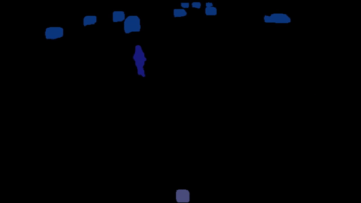
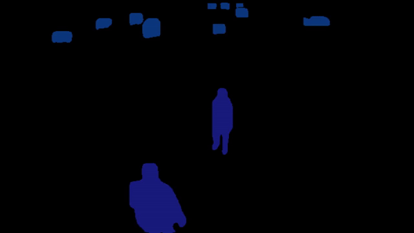

# PHEVA: Privacy-preserving Human-centric Video Anomaly Detection Dataset


## Overview

The PHEVA dataset is a pioneering resource designed to advance research in Video Anomaly Detection (VAD) by addressing key challenges related to privacy, ethical concerns, and the complexities of human behavior in video data. PHEVA is the largest continuously recorded VAD dataset, providing comprehensive, de-identified human annotations across diverse indoor and outdoor scenes. PHEVA provides two distinct data settings: conventional training and continual learning which can be found in this repository.

## Anomalous Behaviors
 PHEVA’s individual anomalies involve throwing, hands up, lying down, and falling. In group situations, anomalies include punching, kicking, pushing, pulling, hitting with an object, and strangling. You can find several segmented examples below.

<table>
  <tr>
    <td align="center">
      <br>
      Example 1: Slapping
    </td>
    <td align="center">
      <br>
      Example 2: Kicking
    </td>
  </tr>
  <tr>
    <td align="center">
      <br>
      Example 3: Falling
    </td>
    <td align="center">
      <br>
      Example 4: Pushing
    </td>
  </tr>
</table>


## Key Features

- **Privacy-Preserving**: PHEVA only includes de-identified human annotations, removing all pixel information to safeguard privacy.
- **Large-Scale Data**: Over 5 million frames with pose annotations, offering more than 5× the training frames and 4× the testing frames compared to previous datasets.
- **Context-Specific Scenarios**: Includes a novel context-specific camera dedicated to law enforcement and security personnel training, allowing for the evaluation of models in highly specialized environments.
- **Continual Learning**: PHEVA supports benchmarks for continual learning, bridging the gap between conventional training and real-world deployment.


*Figure 1: The camera views in PHEVA dataset.*

## Dataset Statistics

| Dataset          | Total Frames | Training Frames | Testing Frames | Normal Frames | Anomalous Frames | Scenes | Cameras |
|------------------|--------------|-----------------|----------------|---------------|------------------|--------|---------|
| **PHEVA**        | 5,196,675    | 4,467,271       | 729,404        | 517,286       | 212,118          | 7      | 7       |
| SHT              | 295,495      | 257,650         | 37,845         | 21,141        | 16,704           | 13     | 13      |
| IITB             | 459,341      | 279,880         | 179,461        | 71,316        | 108,145          | 1      | 1       |
| CHAD             | 922,034      | 802,167         | 119,867        | 60,969        | 58,898           | 1      | 4       |

*Table 1: Statistical comparison of PHEVA with major VAD datasets.*

## Structure of Annotations

Each video has its own dedicated annotation file in .pkl format. 

The files follow the same naming pattern as the videos, and it has a dictionary with the following format:

```python
{
  "Frame_number": 
  {
    "Person_ID": [array([Boudning_Box]), array([Keypoints])]
  }
}
```

Bounding boxes are in XYWH format, and keypoints are in XYC format, where X and Y are coordinates, W is width, H is height, and C is confidence.

You can use the following code snippet to read the pickle files:

```python
import pickle

# Open the pickle file for reading
with open('PHEVA/annotations/test/file.pickle', 'rb') as f:
    # Load the contents of the file into a dictionary
    my_dict = pickle.load(f)

# Print the dictionary to verify that it has been loaded correctly
print(my_dict)
```

## Structure of Anomaly Labels

Anomaly labels are in .npy format.

They exactly follow the same naming pattern, and we have one file per each video. 

Each file is an array of 0s and 1s with the length of the number of frames in each video. 0 means the frame is normal, and 1 means the frame is anomalous.

You can use the following code snnipet to load the files:

```python
import numpy as np

# Load the .npy file
data = np.load('file.npy')

# Print to see the data
print(data)

```
## Benchmarking Results

We benchmarked several State-of-the-Art (SotA) pose-based VAD models on the PHEVA dataset:

| Model     | AUC-ROC | AUC-PR | EER  | 10ER |
|-----------|---------|--------|------|------|
| MPED-RNN  | 76.05   | 42.83  | 0.28 | 0.49 |
| GEPC      | 62.25   | 28.62  | 0.41 | 0.67 |
| STG-NF    | 57.57   | 83.77  | 0.46 | 0.90 |
| TSGAD     | 68.00   | 34.61  | 0.36 | 0.64 |

*Table 2: Benchmarking of SotA pose-based models on PHEVA.*

## Continual Benchmark Train and Test Set Characteristics

Less than 1% of the training data is anomalous to mimic real-world scenarios. The test set is edited to be balanced with an approximate 1:1 ratio of normal to anomalous frames to make metrics such as AUC-ROC and AUC-PR more informative.

<table>
  <tr>
    <th></th>
    <th colspan="4">Continual Train Set</th>
    <th colspan="4">Continual Test Set</th>
  </tr>
  <tr>
    <th></th>
    <th>Total</th>
    <th>Normal</th>
    <th>Anomalous</th>
    <th>Anomaly Percentage</th>
    <th>Total</th>
    <th>Normal</th>
    <th>Anomalous</th>
    <th>Anomaly Percentage</th>
  </tr>
  <tr>
    <td><b>C0</b></td>
    <td>487,835</td>
    <td>483,220</td>
    <td>4,615</td>
    <td>0.95</td>
    <td>52,145</td>
    <td>26,093</td>
    <td>26,052</td>
    <td>49.96</td>
  </tr>
  <tr>
    <td><b>C1</b></td>
    <td>796,860</td>
    <td>791,186</td>
    <td>5,674</td>
    <td>0.71</td>
    <td>57,120</td>
    <td>28,597</td>
    <td>28,523</td>
    <td>49.93</td>
  </tr>
  <tr>
    <td><b>C2</b></td>
    <td>787,301</td>
    <td>780,420</td>
    <td>6,881</td>
    <td>0.87</td>
    <td>50,592</td>
    <td>25,300</td>
    <td>25,292</td>
    <td>49.99</td>
  </tr>
  <tr>
    <td><b>C3</b></td>
    <td>1,260,314</td>
    <td>1,251,189</td>
    <td>9,125</td>
    <td>0.72</td>
    <td>31,604</td>
    <td>15,818</td>
    <td>15,786</td>
    <td>49.95</td>
  </tr>
  <tr>
    <td><b>C4</b></td>
    <td>449,686</td>
    <td>447,918</td>
    <td>1,768</td>
    <td>0.39</td>
    <td>74,482</td>
    <td>37,274</td>
    <td>37,208</td>
    <td>49.95</td>
  </tr>
  <tr>
    <td><b>C5</b></td>
    <td>690,730</td>
    <td>686,435</td>
    <td>4,295</td>
    <td>0.62</td>
    <td>56,621</td>
    <td>28,353</td>
    <td>28,268</td>
    <td>49.92</td>
  </tr>
  <tr>
    <td><b>CSC</b></td>
    <td>558,492</td>
    <td>555,223</td>
    <td>3,269</td>
    <td>0.58</td>
    <td>56,644</td>
    <td>28,343</td>
    <td>28,301</td>
    <td>49.96</td>
  </tr>
</table>


## Citation

If you use PHEVA in your research, please cite our paper:

```
@article{noghre2024pheva,
  title={PHEVA: A Privacy-preserving Human-centric Video Anomaly Detection Dataset},
  author={Ghazal Alinezhad Noghre and Shanle Yao and Armin Danesh Pazho and Babak Rahimi Ardabili and Vinit Katariya and Hamed Tabkhi},
  journal={Arxiv},
  year={2024},
}
```


## Contact

For any questions or support, please contact the authors at [galinezh@charlotte.edu](mailto:galinezh@charlotte.edu).
