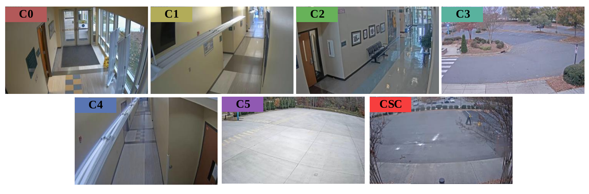

# PHEVA: Privacy-preserving Human-centric Video Anomaly Detection Dataset


## Overview

The PHEVA dataset is a pioneering resource designed to advance research in Video Anomaly Detection (VAD) by addressing key challenges related to privacy, ethical concerns, and the complexities of human behavior in video data. PHEVA is the largest continuously recorded VAD dataset, providing comprehensive, de-identified human annotations across diverse indoor and outdoor scenes.

## Key Features

- **Privacy-Preserving**: PHEVA only includes de-identified human annotations, removing all pixel information to safeguard privacy.
- **Large-Scale Data**: Over 5 million frames with pose annotations, offering more than 5× the training frames and 4× the testing frames compared to previous datasets.
- **Context-Specific Scenarios**: Includes a novel context-specific camera dedicated to law enforcement and security personnel training, allowing for the evaluation of models in highly specialized environments.
- **Continual Learning**: PHEVA supports benchmarks for continual learning, bridging the gap between conventional training and real-world deployment.


*Figure 1: The camera views in PHEVA dataset.*

## Dataset Statistics

| Dataset          | Total Frames | Training Frames | Testing Frames | Normal Frames | Anomalous Frames | Scenes | Cameras |
|------------------|--------------|-----------------|----------------|---------------|------------------|--------|---------|
| **PHEVA**        | 5,196,675    | 4,467,271       | 729,404        | 517,286       | 212,118          | 7      | 7       |
| SHT              | 295,495      | 257,650         | 37,845         | 21,141        | 16,704           | 13     | 13      |
| IITB             | 459,341      | 279,880         | 179,461        | 71,316        | 108,145          | 1      | 1       |
| CHAD             | 922,034      | 802,167         | 119,867        | 60,969        | 58,898           | 1      | 4       |

*Table 1: Statistical comparison of PHEVA with major VAD datasets.*

## Annotation Methodology

- **Bounding Boxes**: Rectangular areas that identify the position of detected humans, utilized for pose estimation and tracking.
- **Person IDs**: Temporal analysis annotations necessary for detecting subtle or complex anomalies in VAD.
- **Human Poses**: Spatial configuration of human body parts, represented as a set of keypoints to facilitate the analysis of body movements.

## Benchmarking Results

We benchmarked several State-of-the-Art (SotA) pose-based VAD models on the PHEVA dataset:

| Model     | AUC-ROC | AUC-PR | EER  | 10ER |
|-----------|---------|--------|------|------|
| MPED-RNN  | 76.05   | 42.83  | 0.28 | 0.49 |
| GEPC      | 62.25   | 28.62  | 0.41 | 0.67 |
| STG-NF    | 57.57   | 83.77  | 0.46 | 0.90 |
| TSGAD     | 68.00   | 34.61  | 0.36 | 0.64 |

*Table 2: Benchmarking of SotA pose-based models on PHEVA.*


*Figure 4: Continual learning benchmark using TSGAD and STG-NF models.*

## Citation

If you use PHEVA in your research, please cite our paper:

```
@article{noghre2024pheva,
  title={PHEVA: A Privacy-preserving Human-centric Video Anomaly Detection Dataset},
  author={Ghazal Alinezhad Noghre and Shanle Yao and Armin Danesh Pazho and Babak Rahimi Ardabili and Vinit Katariya and Hamed Tabkhi},
  journal={Arxiv},
  year={2024},
}
```


## Contact

For any questions or support, please contact the authors at [galinezh@charlotte.edu](mailto:galinezh@charlotte.edu).
